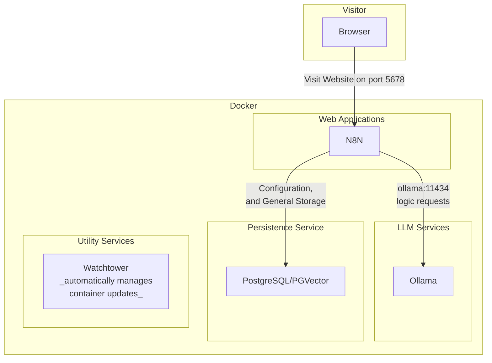

# Service Architecture

```mermaid
graph
    subgraph Visitor
        browser[Browser]
    end

    browser --
        Visit Website on port 5678
    --> n8n

    subgraph Docker
        subgraph Web Applications
            n8n[N8N]
        end

        subgraph LLM Services
            ollama[Ollama]
        end

        n8n -- "ollama:11434"
            logic requests
        --> ollama

        subgraph Persistence Service
            postgres[PostgreSQL/PGVector]
        end

        n8n --
            Configuration,
            and General Storage
        --> postgres

        subgraph Utility Services
            watchtower[Watchtower
                _automatically manages
                container updates_
            ]
        end
    end
```
