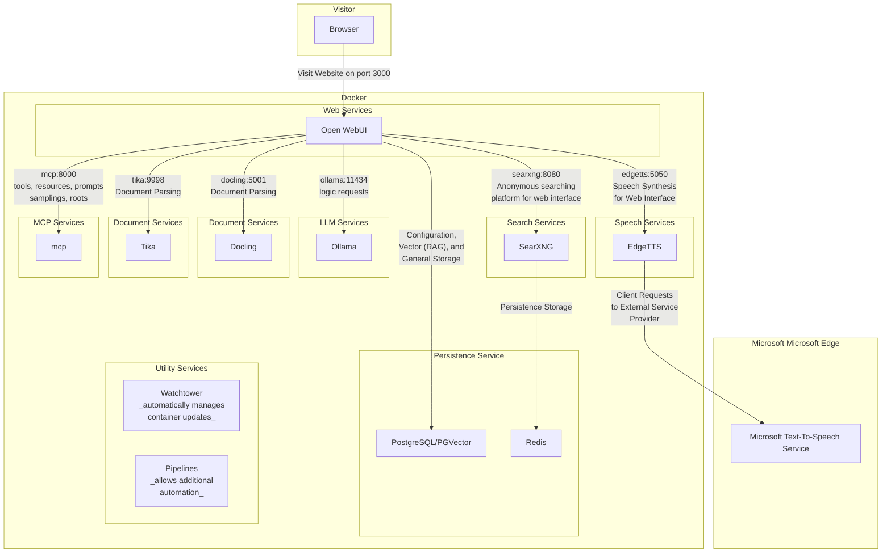

# Service Architecture

```mermaid
graph
    subgraph Visitor
        browser[Browser]
    end

    browser --
        Visit Website on port 3000
    --> openwebui

    subgraph Docker
        subgraph Web Services
            openwebui[Open WebUI]
        end

        subgraph Speech Services
            edgetts[EdgeTTS]
        end

        openwebui -- "edgetts:5050"
            Speech Synthesis
            for Web Interface
        --> edgetts

        subgraph Search Services
            searxng[SearXNG]
        end

        openwebui -- "searxng:8080"
            Anonymous searching
            platform for web interface
        --> searxng

        subgraph LLM Services
            ollama[Ollama]
        end

        openwebui -- ""ollama:11434
            logic requests
        --> ollama

        subgraph Document Services
            docling[Docling]
        end

        openwebui -- "docling:5001"
            Document Parsing
        --> docling

        subgraph Document Services
            tika[Tika]
        end

        openwebui -- "tika:9998"
            Document Parsing
        --> tika

        subgraph MCP Services
            mcp[mcp]
        end

        openwebui -- "mcp:8000"
            tools, resources, prompts
            samplings, roots
        --> mcp

        subgraph Persistence Service
            postgres[PostgreSQL/PGVector]
            redis[Redis]
        end

        openwebui --
            Configuration,
            Vector (RAG), and
            General Storage
        --> postgres

        searxng --
            Persistence Storage
        --> redis

        subgraph Utility Services
            watchtower[Watchtower
                _automatically manages
                container updates_
            ]
            pipelines[Pipelines
                _allows additional
                automation_
            ]
        end
    end

    subgraph Microsoft Microsoft Edge
        microsofonlinesservice[Microsoft Text-To-Speech Service]
    end

    edgetts --
        Client Requests
        to External Service
        Provider
    --> microsofonlinesservice
```
